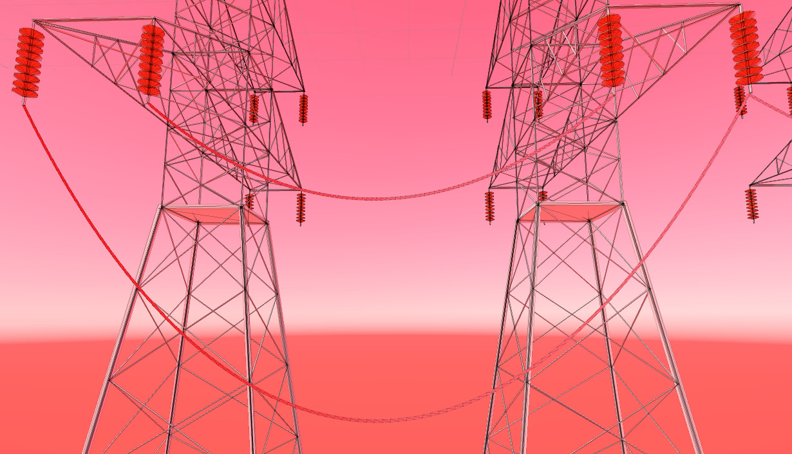
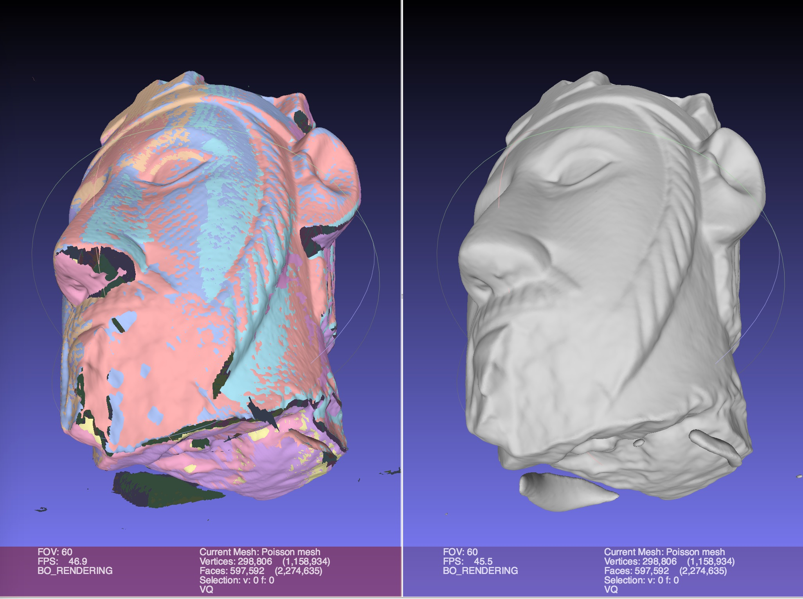
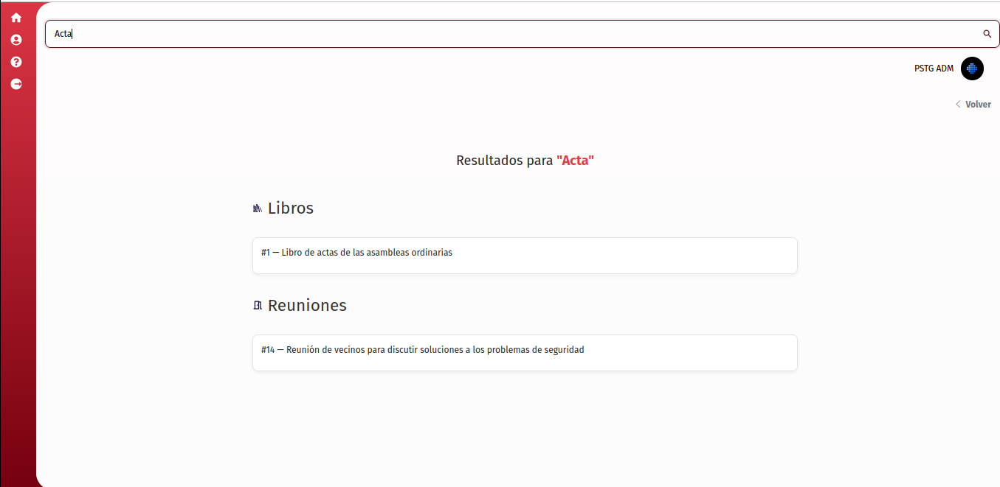
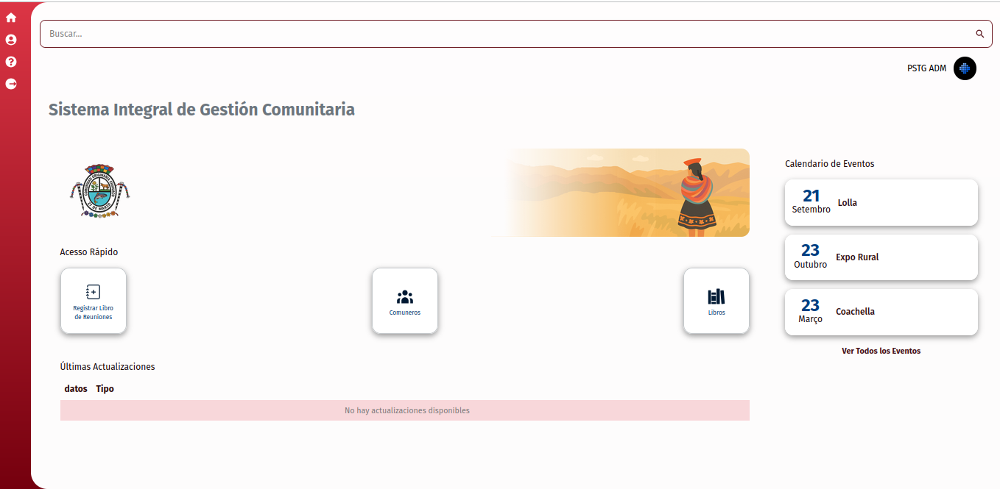

Introduçao ao meu tempo de Aprendizado
=====================================

#### Desenvolvido por Heloiza Custodio [@heloiza786](https://github.com/Heloiza786)

Sumário
-------

1.  [Sobre Esta Apresentação](#_1-sobre-esse-guia)
2.  [Desenvolvimento](#_2-desenvolvimento)
3.  [Projetos](#_3-projetos)
4.  [AutoAvaliação](#_3-autoAvaliação)

1\. Sobre esse guia
----------

Este guia tem como objetivo registrar a minha evolução ao longo do período de estágio na empresa (1 ano), destacando as habilidades que adquiri, as contribuições que realizei e a forma como pude colaborar com a equipe. Nele, apresento também os sistemas que utilizei, os conhecimentos que compartilhei e como cada experiência contribuiu tanto para o meu desenvolvimento profissional quanto para o fortalecimento do trabalho coletivo.

Muito embora o foco deste documento seja a minha trajetória, considero-o um registro em constante construção, que pode e deve ser atualizado à medida que novos aprendizados, práticas e conquistas forem incorporados. Assim, ele reflete não apenas o que já foi realizado, mas também o caminho de evolução contínua que sigo dentro da empresa.
* * *

2\. Desenvolvimento
----------

Durante este um ano na empresa, tive a oportunidade de participar de diversos projetos que marcaram a minha evolução. Nesta apresentação, vou destacar alguns deles e mostrar de que forma contribuíram para o meu desenvolvimento como desenvolvedora.

Foram muitas etapas de aprendizado, cada uma com seus desafios e conquistas, e por isso não seria possível detalhar todas aqui. Ainda assim, preparei um resumo que representa bem essa trajetória e as principais experiências que vivi ao longo desse período.

3\. Projetos 
----------

**Versão:** 1.0  
**Data de Criação:** 16/09/2025  

##  Objetivo  
Neste módulo, apresento alguns dos projetos nos quais atuei, destacando as habilidades técnicas e colaborativas desenvolvidas e aplicadas ao longo do processo.  

- **LT-Dev**  
- **Transmission Line**  
- **Tucuy Development**  

## 3.1 LT-Dev 
- Esse foi meu primeiro projeto na empresa, onde adquiri conhecimento em uma linguagem desafiadora: **Visual Basic**, que atualmente não é tão comum.  
- Com o passar dos meses, desenvolvi um interesse genuíno pela linguagem.  
- Nesse projeto, também aprimorei meus conhecimentos técnicos em **VBA, Macros e Engenharia Elétrica**.  

  

## 3.2 Transmission Line
Projeto voltado para o desenvolvimento de um sistema de **realidade mista (XR)**, acessado por meio de óculos inteligentes. Ele permite que o engenheiro tenha uma experiência imersiva, visualizando cenários em 3D e realizando cálculos de áreas diretamente no ambiente virtual.  

obs: imagem exemplo do projeto

  

### Principais estudos e práticas  

#### Unity  
- Criação de interfaces.  
- Simulação de fatores físicos no ambiente 3D.  
- Reconhecimento de objetos.  
- Demonstração de estudos elétricos (ex.: dilatação de cabos com pontos iniciais e finais que se ajustavam conforme eram alterados).  
- Criação de terrenos e cenários.  
- Conversão de objetos reais para o ambiente virtual.  
- Integração do sistema em dispositivos móveis.  

#### Colmap  
- Geração de malhas de pontos para manipulação de imagens.  
- Desenvolvimento de um **código em Python** que recebia uma imagem, processava a malha de pontos no Colmap, fazia a limpeza e validava coordenadas (x, y, z), prevenindo erros.  

#### MeshLab  
- Manipulação de malhas geradas, adicionando cores, texturas e ajustes.  
- Criação de representações 3D detalhadas, possibilitando exportação para softwares como Unity.  
- Uso dessas malhas em aplicações de realidade mista para futuros projetos.  

## 3.3 TucuyQqahuac  
Projeto atual em que atuo, focado na criação de um **sistema de gestão** para usuários que precisam registrar digitalmente livros e arquivos.  

### Contribuições no Back-End  
- Implementação de **autenticação com JWT**.  
- Criação de múltiplos **endpoints** (models, controllers, services, repositories).  
- Uso de **Docker** para conteinerização.  
- Integração e gerenciamento de **banco de dados**.  
- Aplicação da metodologia **TDD (Test-Driven Development)**.  
- Implementação de **Soft Delete**.  
- Colaboração utilizando **Git**.  

### Contribuições no Front-End  
- Criação de protótipos funcionais.  
- Integração com autenticação via **HttpOnly Token**.  
- Desenvolvimento da **página de buscas**.  
- Desenvolvimento da **página de eventos**.  
- Desenvolvimento da **página de estatisticas**.  

### Pagina de bucas unificadas
-Criação de unificação de busca.  back/front

-Designer realizado

### Pagina de criação/listagem de eventos
-Criação da tebela de eventos 

### Pagina de estatisticas
-Criação de estatisticas

3\. AutoAvaliação
----------
# Autoavaliação  

**Versão:** 1.0  
**Data de Criação:** 16/09/2025  

## 1. Tecnologias Utilidades

- VBA = 4/10  
- Markdown = 2/10  
- C# (Entity Framework) = 5/10  
- TDD = 7/10  
- Figma (protótipos) = 8/10  
- Unity = 6/10  
- Git = 8,5/10  
- Colmap / MeshLab (malha de pontos) = 6/10  
- Realidade aumentada / 3D = 5/10  
- Trello / Kanban = 10/10  
- Banco de dados(MySql) = 8/10  
- Vue/ts = 5,5/10
- Docker = 4/10
- Cypress = 7/10
- Conhecimento em partes especificas da Engenharia Eletrica = 3/10

## 2. Principais Aprendizado  

- Docker  
- C#  
- Unity  
- Markdown  
- Modelagem 3D (Unity, Colmap, MeshLab)  
- Entity Framework  
- Git  
- TDD  

### 3. Áreas de Interesse

**Áreas de interesse para o futuro como desenvolvedor**

Acredito que o momento em que estou na minha vida é um período de experiências e aprendizados. Dentro da empresa, tenho a oportunidade de explorar diferentes tecnologias e desafios. Como futuro cientista da computação, fico satisfeito em participar de projetos variados e inovadores, o que torna difícil definir uma única área de atuação neste momento.

Ainda assim, tenho interesse em aprofundar meus conhecimentos em **redes neurais artificiais**, **API Rest** e desenvolvimento **front-end** e **back-end**, buscando constantemente novas oportunidades para colocar esses aprendizados em prática.

---
