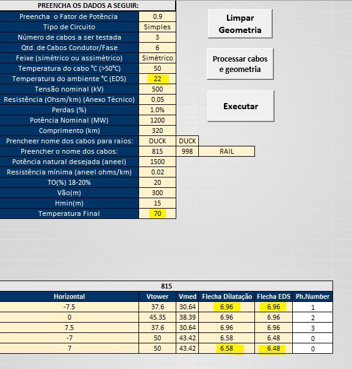
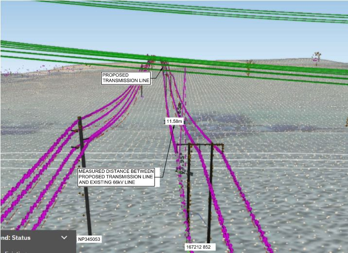
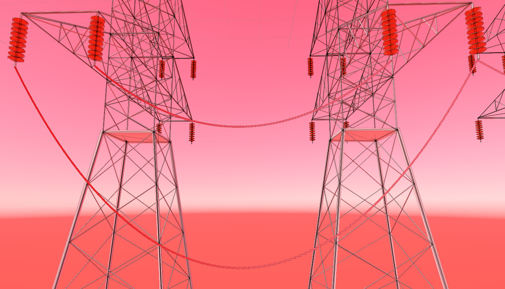
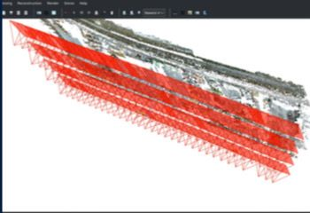
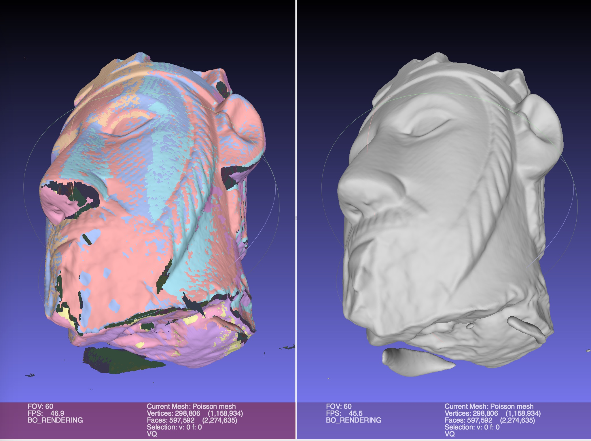
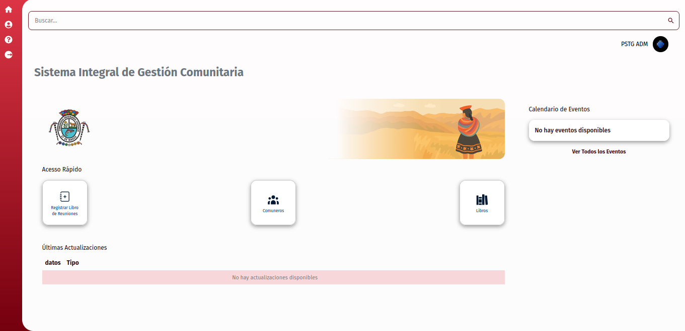
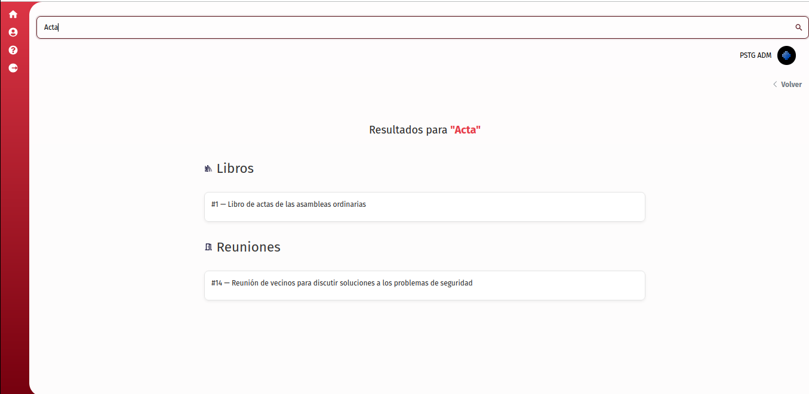
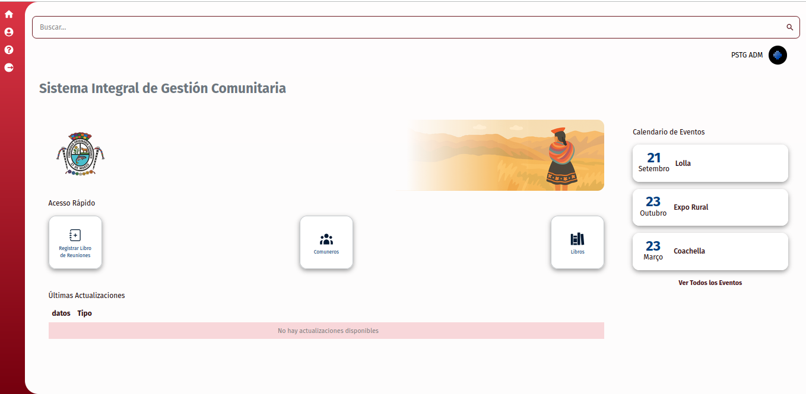
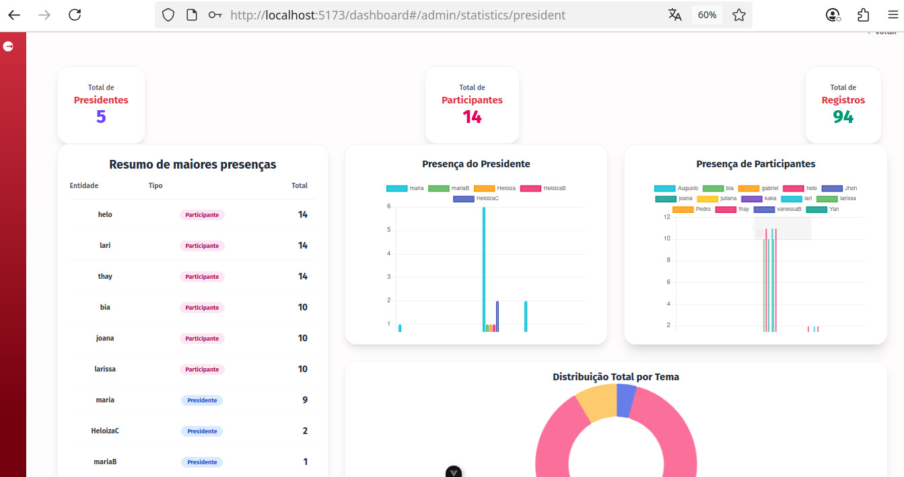

# Projetos Realizados e Habilidades Adquiridas  

**Versão:** 1.0  
**Data de Criação:** 16/09/2025  

## 1. Objetivo  
Neste módulo, apresento alguns dos projetos nos quais atuei, destacando as habilidades técnicas e colaborativas desenvolvidas e aplicadas ao longo do processo.  

## Projetos  
- **Transmission Line**  
- **LT-Dev**  
- **Tucuy Development**  

## 3.1 Transmission Line  
- Esse foi meu primeiro projeto na empresa, onde adquiri conhecimento em uma linguagem desafiadora: **Visual Basic**, que atualmente não é tão comum.  
- Com o passar dos meses, desenvolvi um interesse genuíno pela linguagem.  
- Nesse projeto, também aprimorei meus conhecimentos técnicos em **VBA, Macros e Engenharia Elétrica**.  

  

## 3.2 LT-Dev  
Projeto voltado para o desenvolvimento de um sistema de **realidade mista (XR)**, acessado por meio de óculos inteligentes. Ele permite que o engenheiro tenha uma experiência imersiva, visualizando cenários em 3D e realizando cálculos de áreas diretamente no ambiente virtual.  

obs: imagem exemplo do projeto

  

### Principais estudos e práticas  

#### Unity  
- Criação de interfaces.  
- Simulação de fatores físicos no ambiente 3D.  
- Reconhecimento de objetos.  
- Demonstração de estudos elétricos (ex.: dilatação de cabos com pontos iniciais e finais que se ajustavam conforme eram alterados).  
- Criação de terrenos e cenários.  
- Conversão de objetos reais para o ambiente virtual.  
- Integração do sistema em dispositivos móveis.  

#### Colmap  
- Geração de malhas de pontos para manipulação de imagens.  
- Desenvolvimento de um **código em Python** que recebia uma imagem, processava a malha de pontos no Colmap, fazia a limpeza e validava coordenadas (x, y, z), prevenindo erros.  

#### MeshLab  
- Manipulação de malhas geradas, adicionando cores, texturas e ajustes.  
- Criação de representações 3D detalhadas, possibilitando exportação para softwares como Unity.  
- Uso dessas malhas em aplicações de realidade mista para futuros projetos.  

## 3.3 TucuyQqahuac  
Projeto atual em que atuo, focado na criação de um **sistema de gestão** para usuários que precisam registrar digitalmente livros e arquivos.  

### Contribuições no Back-End  
- Implementação de **autenticação com JWT**.  
- Criação de múltiplos **endpoints** (models, controllers, services, repositories).  
- Uso de **Docker** para conteinerização.  
- Integração e gerenciamento de **banco de dados**.  
- Aplicação da metodologia **TDD (Test-Driven Development)**.  
- Implementação de **Soft Delete**.  
- Colaboração utilizando **Git**.  

### Contribuições no Front-End  
- Criação de protótipos funcionais.  
- Integração com autenticação via **HttpOnly Token**.  
- Desenvolvimento da **página de buscas**.  
- Desenvolvimento da **página de eventos**.  
- Desenvolvimento da **página de estatisticas**.  

### Pagina de bucas unificadas
-Criação de unificação de busca.  back/front

-Designer realizado

### Pagina de criação/listagem de eventos
-Criação da tebela de eventos 

### Pagina de estatisticas
-Criação de estatisticas

